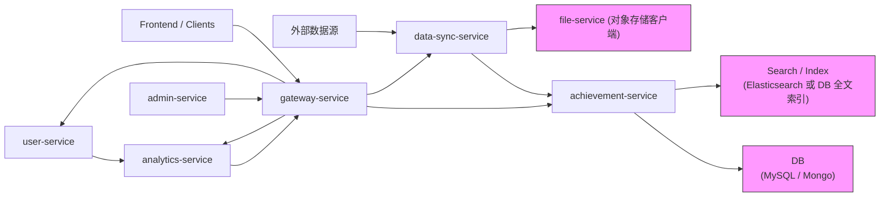

**微服务概览文档**

目的：扫描项目代码并总结每个微服务的核心功能、总体架构，以及围绕若干核心功能（成果检索、学者主页、数据同步）给出设计说明与需手动截取的功能点图片说明。

1) 微服务列表与核心功能

- **gateway-service** — API 网关与统一入口
  - 核心：统一路由、Swagger/OpenAPI 聚合、认证（若配置）。
  - 主要接口：
    - `GET /v3/api-docs/gateway-swagger-config` — 网关 Swagger 配置聚合
    - 路由转发入口（通过网关配置暴露各微服务路径，例如 `/api/users`, `/api/achievements` 等）

- **user-service** — 学者/用户管理
  - 核心：学者信息 CRUD、用户账户管理、学者个人信息聚合接口。
  - 主要接口（示例）：
    - `POST /api/users/normal/register/{validateId}` — 用户注册
    - `POST /api/users/login` — 登录
    - `GET /api/users/current` — 获取当前登录用户
    - `GET /api/users/{userId}` — 获取指定用户/学者信息
    - `GET /api/users/lookup/{username}` — 通过用户名查询
    - `POST /api/users/verification/send` — 发送验证/认证验证码或邮件
    - `POST /api/users/password/reset/{validateId}` — 重置密码
    - `POST /api/users/follow/{userId}` — 关注用户
    - `GET /api/users/follows` 、 `GET /api/users/fans` — 关注/粉丝列表

- **achievement-service** — 学术成果管理
  - 核心：成果条目 CRUD、成果详情、附件元数据管理、按作者/关键词查询基础接口。
  - 主要接口（示例）：
    - `POST /api/achievements` — 创建/上传成果条目
    - `GET /api/achievements/{achId}` — 成果详情
    - `GET /api/achievements/author/{authorId}` — 按作者查询成果
    - `GET /api/achievements/mine` — 当前用户的成果列表
    - `POST /api/achievements/{achId}/cite` — 引用操作
    - `POST /api/achievements/folders` — 创建收藏夹/文件夹
    - `POST /api/achievements/{achId}/collect/{folderId}` — 收藏成果到指定文件夹
    - `GET /api/achievements/folders/{folderId}/items` — 查看收藏夹内条目
    - `GET /api/achievements/collections` — 当前用户的收藏集合
    - `GET /api/achievements/search` — 搜索接口（关键词/过滤）
    - `GET /api/achievements/filter` — 筛选接口

- **file-service** — 附件与对象存储客户端
  - 核心：文件上传/下载、对象存储（如 MinIO/OBS）适配。
  - 主要接口：
    - `POST /api/files/upload` — 多部分文件上传
    - `GET /api/files/check/{fileId}` — 检查文件元信息/状态
    - `GET /api/files/download/{fileId}` — 下载文件

- **data-sync-service** — 数据抓取与同步（ETL）
  - 核心：定时或手动抓取外部数据源、解析、清洗、入库及同步到成果服务或索引。
  - 主要接口：
    - `POST /api/sync/public-db` — 将公共数据源入库/同步（手动触发示例）
    - （可配置的调度/任务接口，见 `DataSyncController`）

- **analytics-service** — 统计与分析接口
  - 核心：基于成果和用户数据的统计、聚合接口（如发表分布、Top authors）。
  - 主要接口：
    - `POST /api/analysis/collect-search` — 聚合检索统计
    - `POST /api/analysis/author-relationship` — 作者关系/协同网络分析

- **admin-service** — 管理后台相关接口（权限/系统配置等）
  - 核心：系统管理功能、任务监控或管理操作接口。
  - 主要接口（示例）：
    - 管理/审计接口（如审核用户认证、查看系统任务状态），具体路径视实现而定。

2) 微服务总体架构（Mermaid 图）

说明：API 请求统一经过 `gateway-service` 路由，微服务间以 HTTP REST 调用或异步消息（项目未强制，但建议引入 MQ）通信，持久化由 MySQL/Mongo（见各服务 `application.yml`）与对象存储承担。

3) 核心功能设计说明（成果搜索、成果收藏、科研人员认证、成果上传）

- 成果搜索（Achievement Search）
  - 目标：提供按标题/作者/关键词/年份/机构的高效检索，支持分页、高亮与聚合统计。
  - 主要后端接口：
    - `GET /api/achievements/search` — 关键词+过滤查询（由 `gateway` 转发到 `achievement-service`）
    - `GET /api/achievements/{achId}` — 单条成果详情（用于结果详情页）
  - 设计要点：
    - 数据同步：写操作在 `achievement-service` 写入数据库后，异步更新搜索索引（Elasticsearch 或 DB 全文索引）。
    - 查询流：客户端 -> `gateway` -> `achievement-service` -> （如果启用 ES）查询 ES -> 返回。
    - 可扩展性：采用分页 + 聚合接口，热点查询可用缓存（Redis）加速。
  - 建议截图：`docs/screenshots/achievement-search.png`, `docs/screenshots/achievement-detail.png`

- 成果收藏（Collections / Folders）
  - 目标：允许用户创建收藏夹、将成果收藏到文件夹，并管理个人收藏集合。
  - 主要后端接口（示例）：
    - `POST /api/achievements/folders` — 创建收藏夹
    - `POST /api/achievements/{achId}/collect/{folderId}` — 将成果收藏到指定文件夹
    - `GET /api/achievements/folders/{folderId}/items` — 列出文件夹内条目
    - `GET /api/achievements/collections` — 列出用户所有收藏
  - 设计要点：
    - 数据模型：用户-文件夹-收藏项三层结构，收藏项引用成果 ID 并含收藏时间/标签。
    - 一致性：收藏属于用户私有，数据库事务保证创建收藏夹+入库的原子性。
    - 前端交互：在成果详情页提供“收藏”按钮，调用 `/collect` 接口并返回最新收藏状态。
  - 建议截图：`docs/screenshots/achievement-collect.png`（新建并收藏示例）

- 科研人员认证（Researcher Verification）
  - 目标：为科研人员提供身份/资质认证流程（提交证明材料 -> 后台审核 -> 标记认证状态）。
  - 主要后端接口（示例）：
    - `POST /api/users/verification/send` — 发送验证/验证码（用于邮箱/手机验证）
    - `POST /api/users/{userId}/verification/submit` — 提交认证材料（若实现）
    - `GET /api/admin/verification/pending` — 管理后台查看待审核（由 admin-service 暴露）
    - `POST /api/admin/verification/{id}/approve` — 管理员通过认证
  - 设计要点：
    - 流程：用户提交材料 -> status=Pending -> admin-service 审核 -> 更新 user-service 中的认证字段。
    - 安全与隐私：上传材料应通过 `file-service` 存储并仅授权访问；认证记录需审计日志。
    - 异步通知：审核结果通过邮件/站内消息通知用户。
  - 建议截图：`docs/screenshots/verification-submit.png`, `docs/screenshots/verification-admin.png`

- 成果上传（Upload / Submit Achievement）
  - 目标：支持用户提交成果元数据及附件（文件），并触发后续索引与统计更新。
  - 主要后端接口（示例）：
    - `POST /api/files/upload` — 上传附件（multipart）到 `file-service`
    - `POST /api/achievements` — 创建成果条目，包含附件引用
  - 设计要点：
    - 流程：客户端上传文件 -> `file-service` 返回 fileId -> 客户端在创建成果时包含 fileId -> `achievement-service` 保存元数据并异步写入搜索索引/触发分析任务。
    - 事务边界：文件上传与成果创建为两个独立步骤，建议在创建失败时保留文件并标记为未关联，定期清理孤立文件。
    - 校验：对上传文件类型/大小及成果元数据（DOI、标题、作者）进行校验，避免重复入库。
  - 建议截图：`docs/screenshots/achievement-upload.png`

服务间通信模式说明：
- 同步：用户请求通过 `gateway` 转发到对应微服务（REST）。
- 异步：写操作后使用消息队列或异步任务（或直接 HTTP）更新搜索索引与触发统计分析，以降低写请求响应延迟。

4) 手动截屏说明（把图片放到 `docs/screenshots/`）
- achievement-search.png — 搜索演示（在 Swagger UI 或前端中执行搜索并截取结果）
- achievement-detail.png — 成果详情页（包含元数据和附件链接）
- scholar-page.png — 学者主页（展示成果列表、时间线与统计）
- data-sync-ui.png — 数据同步任务或抓取日志

